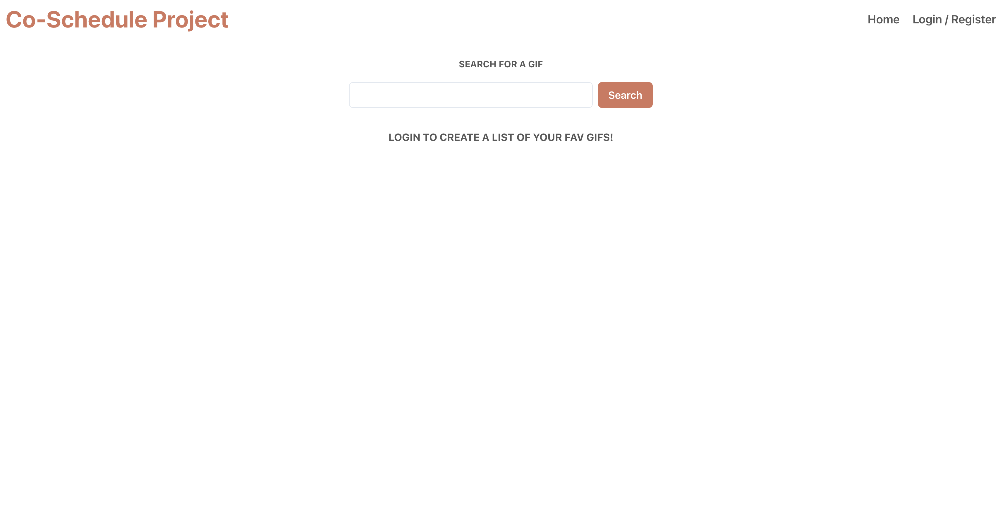
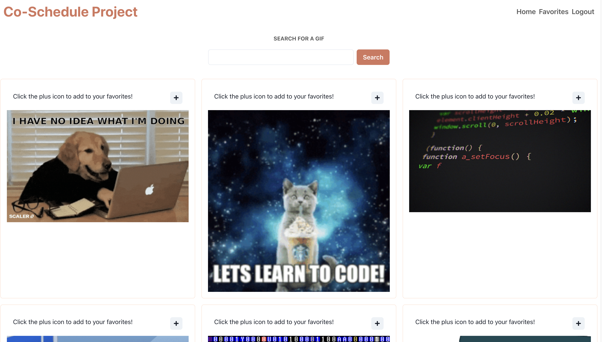

# Giphy API Project

This is an application that allows a user to search the Giphy API. 
It allows registered users additional functionality such as adding to their favorites list and filtering their favorites based on rating.

## Getting Started

- To get started with this application, you will first need to fork and clone it down to your local computer.
- I use postgreSQL for my database on postico. 
- create a new database with a name of your choosing and copy the `database.sql` file from the database and run the queries.
One thing to note here is if you want to change it to a differnet name make sure to change the `pool.js` file in the `modules` folder.

Once you have your database going, you can jump in to your terminal and run `npm install` to install the neccesary dependencies.

- after everything in installed you can goahead and open a terminal inside your code editor and run `npm run server`.
- open a second terminal and run `npm run client`
- you'll also want to create a new `.env` with a `SERVER_SESSION+SECRET` for the cookie session security.

And you should be good to go!

## Pages and functions

;

This page allows the user to search for gifs as well as allow them to log in and register through the nav bar

This is what a user search will look like.
- They have the ability to go to their `favoritres` as well as add a gif to their favorites.

The user favorites page allows the registered user the ability to sculpt their favorites list in a few ways.
- They can rate their gifs and leave comments on them.
- They can sort their gifs by rating
- Note that if a gif is added the rating comes in a 0 by default, so the user has to go to the tab marked `Not Yet Rated` to rate it.
- Delete a gif.

### Highlighted technologies

- Chakra UI for the front end ui library
- Redux
- Node.js
- React.js
- Passport.js

